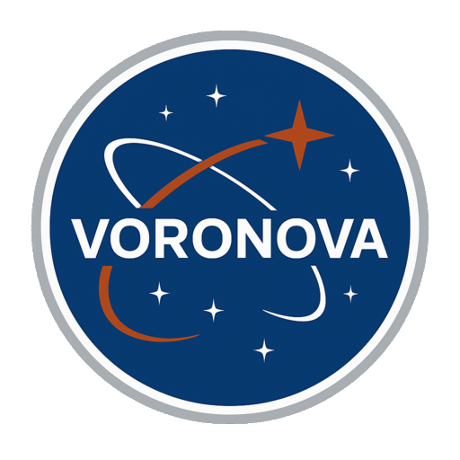

# 🚀 VoroNova - AI-Powered Space Habitat Design Platform

<div align="center">
  
  
  **Revolutionary AI-driven space architecture design for the next generation of space exploration**

[](./FrontEnd/README.md)
[](./Backend/README.md)
[](./Backend/README.md#how-the-ai-models-work)
</div>

---

## 🌟 What is VoroNova?

**VoroNova** is an innovative AI-powered platform that revolutionizes space habitat design by combining cutting-edge artificial intelligence with NASA's authentic space architecture data. Our platform enables students, engineers, and space enthusiasts to create, edit, and visualize space habitat designs using AI models trained on real NASA schematics.

### 🎯 Our Mission
To democratize space habitat design by providing intelligent tools that transform complex engineering challenges into innovative, space-ready solutions using authentic NASA data and cutting-edge AI technology.

### 🚀 Vision
Empowering the next generation of space explorers with AI-driven design tools that make space habitat engineering accessible, educational, and inspiring. We address the critical challenge that researchers face when designing space habitats according to complex requirements:

- **Requirements and Mission Context** - Understanding specific mission needs and constraints
- **Resources and Physical Constraints** - Optimizing limited space and materials
- **Challenges and Evaluation Criteria** - Meeting safety, efficiency, and functionality standards
- **Living Volume Optimization** - Creating appropriate space for mission duration
- **Zoning and Division** - Efficiently organizing habitat spaces for different functions

VoroNova accelerates this traditionally time-consuming process by providing AI-powered design assistance that considers all these factors simultaneously, making space habitat design faster and more accessible for both students and professionals.

---

## 🏗️ Project Architecture

VoroNova consists of two main components:

### 🎨 [Frontend](./FrontEnd/README.md)
- **Next.js 15** with React 19 and TypeScript
- **Tailwind CSS v4** with custom space-themed animations
- **Radix UI** components with shadcn/ui design system
- **Interactive 2D/3D visualization** of space habitats
- **Real-time AI chat interface** for design assistance

### ⚙️ [Backend](./Backend/README.md)
- **Python Flask** REST API server
- **AI Model Integration** with Replicate platform
- **NASA Dataset Training** using authentic space habitat schematics
- **2D to 3D conversion** capabilities
- **CAD-like editing operations** (ADD/MODIFY/REMOVE)

---

## 🤖 AI Technology Stack

### 🍌 Nano-Banana (Image Generation)
- **Model**: `google/nano-banana` with fallback to `bytedance/seedream-4`
- **Training Data**: 22 authentic NASA space habitat schematics
- **Capabilities**: 
  - Real-time multi-image training
  - Space habitat floor plan generation
  - Style consistency with NASA standards
- **Cost**: ~$0.037 per generation (27 runs per $1)
- **Runtime**: Typically completes within 27 seconds

### 🏗️ Trellis (2D to 3D Conversion)
- **Model**: Microsoft's TRELLIS with 1.2B parameters
- **Training**: 500K 3D objects dataset
- **Capabilities**:
  - Multi-angle 3D generation (4 perspectives)
  - GLB model output with textures
  - 3D Gaussians and Radiance Fields
  - High-quality shape and texture generation
- **Status**: Demonstration scripts available (API integration pending)
- **Hardware**: Nvidia A100 (80GB) GPU

### 📚 NASA Dataset Integration
Our AI models are trained on authentic NASA space habitat designs:

| Habitat Type | Images | Description |
|--------------|--------|-------------|
| **Lunar Surface Habitat (LSH)** | 7 schematics | Surface-based lunar living modules |
| **Mars Transit Habitat (MTH)** | 3 schematics | Interplanetary transit vehicle designs |
| **NASA Scenario 12.0 PCM** | 6 schematics | Pressurized Core Module designs |
| **TransHab Inflatable** | 6 schematics | Large-scale inflatable spacecraft |

**Total**: 22 NASA space habitat schematics for authentic training

### 🎨 NASA 3D Resources Library
We integrate with [NASA's official 3D Resources repository](https://github.com/nasa/NASA-3D-Resources) to provide:
- **Authentic 3D Models**: Real NASA spacecraft, habitats, and equipment
- **Drag-and-Drop Integration**: Easy addition of NASA assets to designs
- **Professional Validation**: Using official NASA models ensures accuracy
- **Educational Value**: Students learn with real space technology models

---

## 🚀 Key Features

### 🤖 AI-Driven Design Generation
- **Intelligent Floor Plans**: Generate space habitat layouts based on NASA standards
- **Real-time Training**: AI learns from NASA schematics during each generation
- **Style Consistency**: Maintains architectural accuracy of authentic space designs
- **Multi-Image Processing**: Uses entire NASA dataset for each generation

### ✏️ Interactive Design Tools
- **CAD-like Editing**: ADD/MODIFY/REMOVE operations on generated designs
- **Real-time Visualization**: Instant preview of design changes
- **Parameter Controls**: Adjust scale, complexity, and feature toggles
- **Annotation Tools**: Pencil, ruler, move, and resize capabilities

### 🎨 Advanced Visualization
- **2D/3D Views**: Switch between different visualization modes
- **Orbital Animations**: Beautiful space-themed UI animations
- **Multi-Angle Rendering**: 4 different 3D perspectives per design
- **Export Capabilities**: GLB models, videos, and point clouds

### 📊 Design Analysis
- **AI Suggestions**: Intelligent recommendations for improvements
- **Efficiency Metrics**: Space utilization and optimization scores
- **Safety Analysis**: Structural and life support system validation
- **Cost Optimization**: Resource and material efficiency calculations

---

## 🛠️ Technology Stack

### Frontend Technologies
- **Framework**: Next.js 15 with App Router
- **Language**: TypeScript 5
- **Styling**: Tailwind CSS v4 with custom animations
- **UI Components**: Radix UI with shadcn/ui
- **Icons**: Lucide React
- **Fonts**: Geist Sans & Mono
- **Deployment**: Vercel with Analytics

### Backend Technologies
- **Framework**: Python Flask with CORS support
- **AI Platform**: Replicate API integration
- **Image Processing**: Pillow (PIL)
- **Environment**: python-dotenv for configuration
- **HTTP Client**: Requests library
- **Server**: Werkzeug WSGI

### AI & ML Stack
- **Image Generation**: Google Nano-Banana, ByteDance SeedDream
- **3D Conversion**: Microsoft Trellis
- **Training Data**: NASA space habitat schematics
- **Cloud Platform**: Replicate (Nvidia A100 GPUs)
- **Image Storage**: ImgBB for reference images

---

## 🎯 Initial Vision vs Current Implementation

### 🌟 Original Goal: NASA RAG System
Our initial vision was to create a comprehensive RAG (Retrieval-Augmented Generation) system trained on all NASA research papers to provide intelligent space habitat design assistance.

### 🔄 Pivot to Structured Forms
During development, we realized that:
- **API Limitations**: Full RAG implementation required extensive API development
- **User Experience**: Pre-defined form responses provide better UX than open-ended chat
- **Cost Efficiency**: Structured inputs reduce AI generation costs
- **Reliability**: Form-based responses are more consistent and predictable

### ✅ Current Approach
- **Hybrid System**: Combines AI generation with structured form inputs
- **NASA Dataset Training**: Uses authentic space habitat schematics
- **Focused Scope**: Specialized in space architecture rather than general NASA research
- **Better Performance**: Faster, more reliable, and cost-effective

---

## 💰 Runtime & Cost Analysis

### Nano-Banana (Image Generation)
- **Cost**: ~$0.037 per generation
- **Value**: 27 runs per $1
- **Hardware**: Nvidia A100 (80GB) GPU
- **Runtime**: ~27 seconds per generation
- **Efficiency**: Real-time training with NASA dataset

### Trellis (3D Conversion)
- **Status**: Demonstration scripts only (API integration pending)
- **Reason**: High computational cost and processing time
- **Alternative**: Focus on 2D design generation for current resources
- **Future**: Full 3D API integration planned for next phase

### Resource Optimization
- **Current Focus**: 2D space habitat design generation
- **Cost Management**: Efficient use of AI credits through structured inputs
- **Scalability**: Designed for future 3D integration when resources allow

---

## 🚀 Getting Started

### Quick Navigation
- **[Frontend Setup](./FrontEnd/README.md#-getting-started)** - Next.js development environment
- **[Backend Setup](./Backend/README.md#setup)** - Python Flask API server
- **[API Documentation](./Backend/API_DOCUMENTATION.md)** - Complete API reference

### Prerequisites
- **Node.js 18+** for frontend development
- **Python 3.8+** for backend services
- **Replicate API Key** for AI model access
- **ImgBB API Key** for image storage

### Installation
1. **Clone the repository**
   ```bash
   git clone https://github.com/your-username/voronova.git
   cd voronova
   ```

2. **Setup Frontend**
   ```bash
   cd FrontEnd
   npm install
   npm run dev
   ```

3. **Setup Backend**
   ```bash
   cd Backend
   pip install -r requirements.txt
   python flask_api.py
   ```

---

## 📁 Project Structure

```
VoroNova/
├── FrontEnd/                    # Next.js React application
│   ├── app/                    # App Router pages
│   ├── components/             # React components
│   ├── lib/                    # Utilities and API client
│   └── public/                 # Static assets
├── Backend/                    # Python Flask API
│   ├── dataset/                # NASA space habitat schematics
│   ├── 2d-3d/                  # Trellis 3D conversion scripts
│   ├── test_cases/             # API testing scripts
│   ├── flask_api.py            # Main API server
│   └── requirements.txt        # Python dependencies
└── README.md                   # This file
```

---

## 🎯 Use Cases

### 🎓 Educational (All Ages)
- **Space Engineering Students**: Learn space habitat design principles and interior/exterior definitions
- **STEM Education**: Interactive space architecture lessons with real NASA models
- **K-12 Learning**: Age-appropriate space habitat exploration and design
- **Research Projects**: Generate design variations for analysis and learning

### 🏗️ Professional Researchers
- **Advanced 2D to 3D Mode**: Convert designs into full 3D models for detailed analysis
- **Habitat Stacking**: Connect and stack multiple habitat modules
- **Drag-and-Drop Assembly**: Add NASA 3D models and equipment via intuitive interface
- **Mission-Specific Design**: Address complex requirements and constraints efficiently
- **Collaborative Design**: Team-based habitat development and iteration

### 🚀 Research & Development
- **NASA Contractors**: Design validation and optimization using authentic NASA data
- **Space Companies**: Commercial habitat design exploration with professional tools
- **Academic Research**: Space architecture methodology studies and validation
- **Mission Planning**: Pre-mission habitat layout optimization for specific mission contexts

---

## 🔮 Future Roadmap

### Phase 1: Current (2D Focus)
- ✅ NASA dataset integration
- ✅ AI-powered 2D generation
- ✅ Interactive editing tools
- ✅ REST API development

### Phase 2: 3D Integration
- 🔄 Trellis API integration for real-time 3D conversion
- 🔄 NASA 3D Resources library integration
- 🔄 Drag-and-drop 3D model assembly
- 🔄 Habitat stacking and connection tools
- 🔄 VR/AR visualization support

### Phase 3: Advanced Features
- 📋 Multi-habitat design systems with complex stacking
- 📋 Professional-grade collaborative design platform
- 📋 Advanced AI training on expanded NASA datasets
- 📋 Integration with space mission planning tools
- 📋 Real-time requirement validation and constraint checking

---

## 🤝 Contributing

We welcome contributions from the space engineering and AI communities!

### How to Contribute
1. **Fork the repository**
2. **Create a feature branch** (`git checkout -b feature/amazing-feature`)
3. **Make your changes** with proper documentation
4. **Test thoroughly** using the provided test cases
5. **Submit a pull request** with detailed description

### Areas for Contribution
- **AI Model Integration**: New models or improved training
- **UI/UX Improvements**: Better user experience
- **NASA Data**: Additional space habitat schematics
- **Documentation**: Tutorials and guides
- **Testing**: Comprehensive test coverage

---

## 📄 License

This project is licensed under the MIT License - see the [LICENSE](LICENSE) file for details.

---

## 🙏 Acknowledgments

- **NASA** for providing authentic space habitat schematics and design inspiration
- **Microsoft** for the Trellis 3D generation model
- **Google** for the Nano-Banana image generation model
- **Replicate** for providing accessible AI model hosting
- **Open Source Community** for amazing libraries and tools

---

## 📞 Contact & Support

- **Project Repository**: [GitHub Repository](https://github.com/your-username/voronova)
- **Issues & Bug Reports**: [GitHub Issues](https://github.com/your-username/voronova/issues)
- **Documentation**: [Wiki](https://github.com/your-username/voronova/wiki)
- **Community**: [Discussions](https://github.com/your-username/voronova/discussions)

---

<div align="center">
  <p>🚀 <strong>Made with ❤️ for the future of space exploration</strong> 🚀</p>
  <p>⭐ <em>Star this repository if you found it helpful!</em> ⭐</p>
  
  <p>
    <a href="./FrontEnd/README.md">🎨 Frontend Documentation</a> • 
    <a href="./Backend/README.md">⚙️ Backend Documentation</a> • 
    <a href="./Backend/API_DOCUMENTATION.md">📚 API Reference</a>
  </p>
</div>
