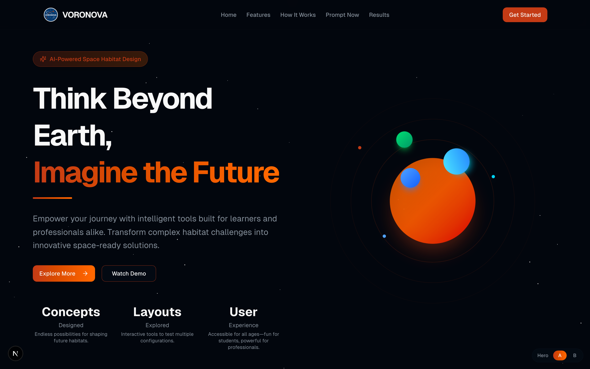
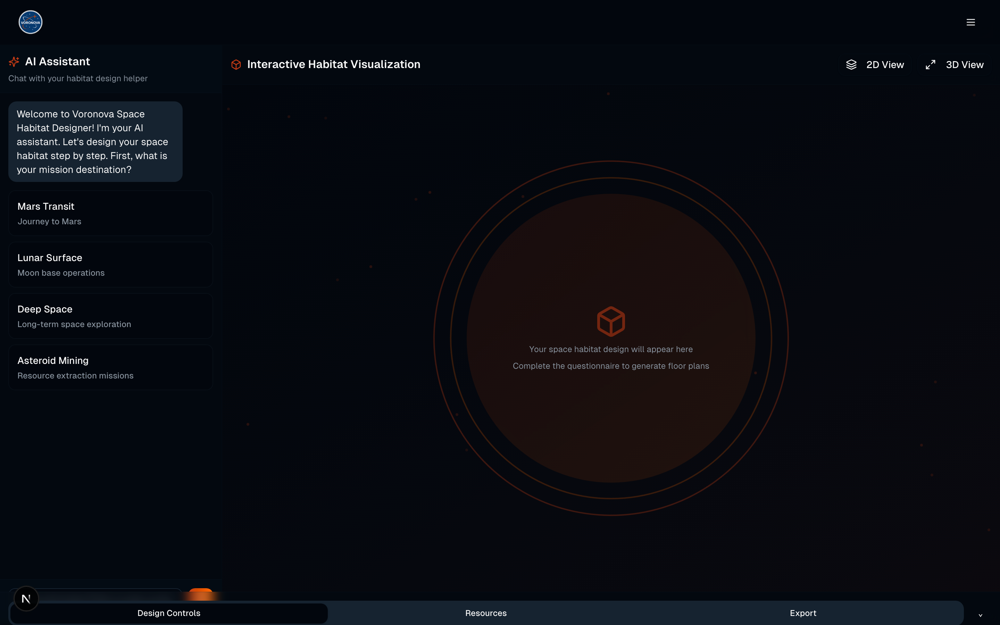
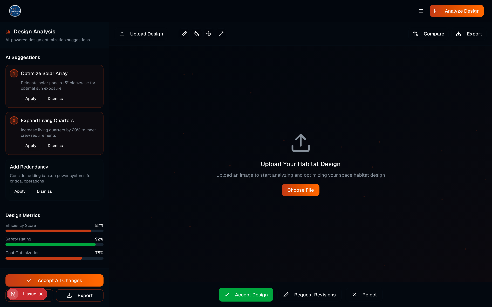
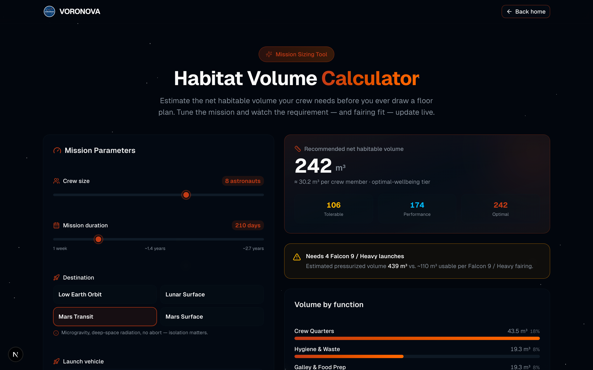
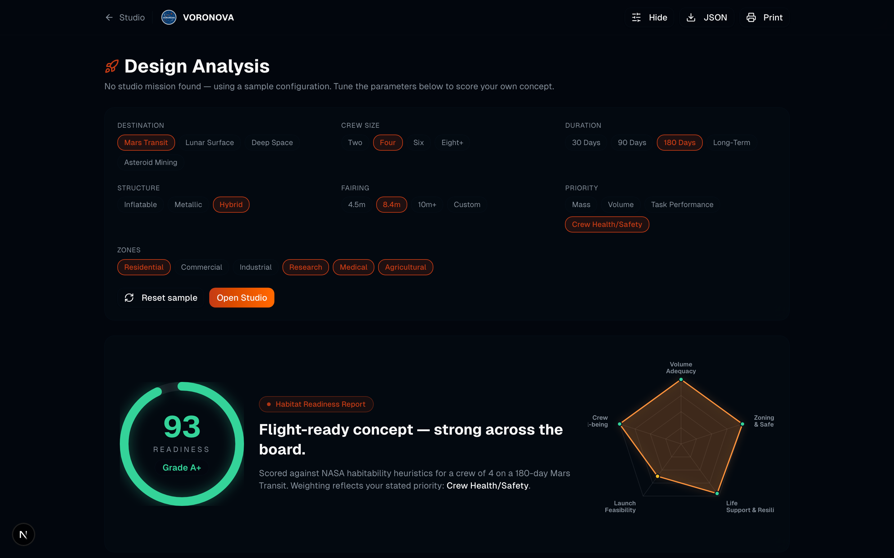
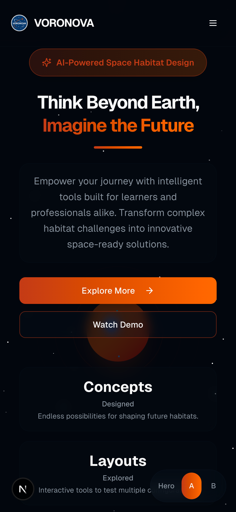
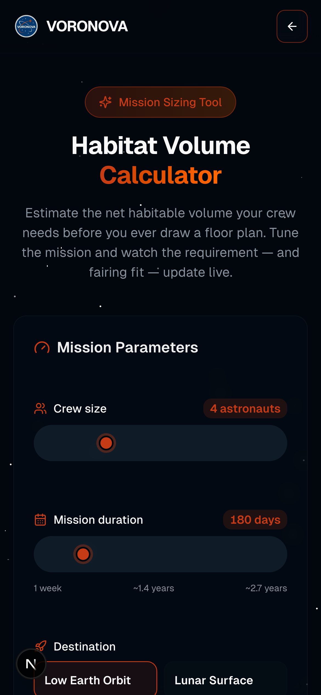
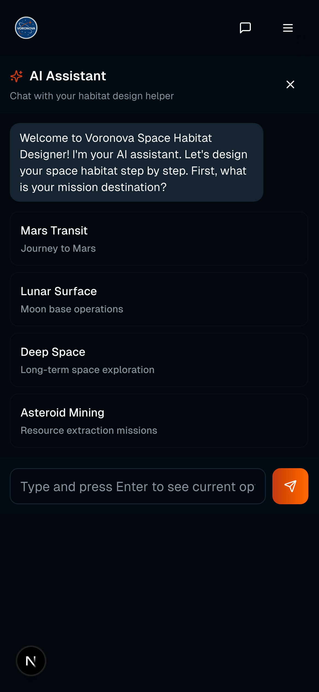

<div align="center">
  

  # VoroNova

  ### Think beyond Earth. Design the habitat that gets you there.

  **An AI-powered design studio for space habitats — trained on authentic NASA schematics.**

  <br/>

  
  
  
  

</div>

---

<div align="center">
  
  <br/>
  <em>From "think beyond Earth" to a scored, flight-ready concept — in one uninterrupted flight path.</em>
</div>

---

## Houston, what is this? 🛰️

**VoroNova** takes one of the hardest jobs in aerospace — laying out a habitat that keeps humans alive,
sane, and productive in deep space — and turns it into something you can *actually play with*.

Describe a mission ("a four-person Mars transit, 6 months, heavy on the greenhouse"), and VoroNova's AI
generates a real floor plan, lets you nudge it around in 2D, flips it into a 3D view, and scores it on
efficiency, safety, and cost. It's trained on **22 authentic NASA space-habitat schematics**, so the
suggestions aren't science *fiction* — they're grounded in the real constraints engineers wrestle with:
living volume, zoning, life support, and crew well-being.

Built for students who want to learn, engineers who want to iterate faster, and anyone who has ever
looked up and thought *"I could design that."*

> No spacesuit required. Just a browser and a little curiosity.

---

## The tour ✨

| Landing | Design Studio | AI Assistant Results |
|:---:|:---:|:---:|
|  |  |  |

| Habitat Volume Calculator | Habitat Readiness Analysis |
|:---:|:---:|
|  |  |

<div align="center">
  
  &nbsp;&nbsp;
  
  &nbsp;&nbsp;
  
  <br/>
  <em>Fully responsive — mission control fits in your pocket.</em>
</div>

---

## Fresh off the launchpad 🆕

The latest iteration adds two standalone mission-planning tools and a big polish + reliability pass:

- **🧮 Habitat Volume Calculator** (`/calculator`) — a NASA-grounded sizing tool. Dial in crew size,
  mission duration, destination and launch vehicle, and watch the *net habitable volume*, per-crew
  wellbeing tiers (tolerable → performance → optimal), fairing fit, and function-by-function breakdown
  update **live**. Know how big your habitat needs to be *before* you draw a single wall.
- **🚀 Habitat Readiness Analysis** (`/analysis`) — score any concept against NASA habitability heuristics
  and get a letter grade (that A+ isn't going to earn itself), a radar chart across Volume, Zoning, Life
  Support, Launch Feasibility and Crew Wellbeing, plus prioritized recommendations. Export to JSON or print.
- **🎛️ A/B landing experience** — a second hero variant lives behind `?variant=b` (flip it with the
  toggle in the corner) so design directions can be tested, not just argued about.
- **♿ Accessibility + performance** — skip links, ARIA landmarks and labels, keyboard-navigable dialogs,
  `prefers-reduced-motion` support, and a 97%-smaller logo. Mission control for *everyone*.
- **📱 Touch & mobile hardening** — scroll-locking mobile menu, safer touch targets, and layout fixes
  across the app.
- **🧪 Test suite + CI** — unit tests (Vitest) and end-to-end smoke tests (Playwright) wired into GitHub Actions.

## What it does 🚀

- **AI habitat generation** — describe a mission in plain English, get a real floor plan back.
- **Conversational designer** — a step-by-step AI assistant walks you from "mission destination" to
  finished layout (Mars transit, lunar surface, deep space, asteroid mining… pick your adventure).
- **2D ↔ 3D visualization** — sketch it flat, then see it in three dimensions.
- **CAD-style editing** — `ADD`, `MODIFY`, and `REMOVE` operations on any generated plan.
- **Design analysis** — automatic scoring for efficiency, safety, and cost, plus actionable
  "Optimize solar array" / "Expand living quarters" suggestions.
- **Export & compare** — download your designs and put alternatives side by side.
- **Space-grade UI** — animated star fields, orbit systems, scroll progress, reveal-on-scroll sections
  and a dark theme pulled straight from the VoroNova logo palette. Respects `prefers-reduced-motion`,
  because not everyone wants the cosmos spinning.

---

## Under the hood 🧰

VoroNova is a two-part system living in one repo:

```
VoroNova/
├── FrontEnd/     → Next.js 15 · React 19 · TypeScript · Tailwind v4 · shadcn/ui
└── Backend/      → Python Flask REST API · Replicate AI models · NASA dataset
```

- **Frontend** is a static-exported Next.js app (`output: 'export'`) — deploys anywhere that can serve
  files. It talks to the backend over a small typed API layer in `FrontEnd/lib/api.ts`.
- **Backend** is a Flask API that orchestrates the AI models (image generation + 2D→3D), stores
  renders, and serves downloads. Full endpoint docs live in [`Backend/API_DOCUMENTATION.md`](./Backend/API_DOCUMENTATION.md).

---

## Get it running locally 👩‍🚀

You'll need two terminals — one for the ground station (backend), one for the cockpit (frontend).

### Prerequisites

- **Node.js 18+** and **npm** — check with `node -v` (grab it from [nodejs.org](https://nodejs.org)).
- **Python 3.10+** and **pip** — check with `python3 --version`.
- *(Optional, for live AI)* a free [Replicate](https://replicate.com) API token and an
  [ImgBB](https://api.imgbb.com) key. Without them the UI still runs and demonstrates the flow.

### 1. Clone the repo

```bash
git clone https://github.com/waleedsworld/VoroNova.git
cd VoroNova
```

### 2. Launch the frontend (cockpit)

```bash
cd FrontEnd
npm install
npm run dev
```

Open **http://localhost:3000** and you're flying. Want to sanity-check the flight instruments? Try
[localhost:3000/calculator](http://localhost:3000/calculator) and
[localhost:3000/analysis](http://localhost:3000/analysis). Curious about the other hero? Append
`?variant=b`. To build the production static export instead:

```bash
npm run build      # outputs to FrontEnd/dist/
```

### Run the tests 🧪

```bash
cd FrontEnd
npm run test:unit    # Vitest unit tests
npm run test:e2e     # Playwright smoke tests (installs browsers on first run)
```

### 3. Launch the backend (ground station)

```bash
cd Backend
python3 -m venv .venv
source .venv/bin/activate        # Windows: .venv\Scripts\activate
pip install -r requirements.txt

cp .env.example .env             # then drop in your API keys
python flask_api.py
```

The API comes up on **http://localhost:5001**. Quick health check:

```bash
curl http://localhost:5001/health
```

### Wiring them together

The frontend points at the hosted API (`https://plangen.waleeds.world`) by default. To use your local
backend, change `API_BASE_URL` at the top of `FrontEnd/lib/api.ts` to `http://localhost:5001`.

---

## API at a glance 📡

| Method | Endpoint | What it does |
|:---|:---|:---|
| `POST` | `/create_plan` | Generate floor plans from zone definitions |
| `POST` | `/edit` | Apply `ADD` / `MODIFY` / `REMOVE` edits to a plan |
| `GET`  | `/health` | Service heartbeat |
| `GET`  | `/download/<file>` | Fetch a rendered design |

Full request/response shapes are in [`Backend/API_DOCUMENTATION.md`](./Backend/API_DOCUMENTATION.md).

---

## Live demo 🌍

**Deploying soon** — the static frontend is ready to ship; the live link lands here shortly.

---

## Tech stack 🪐

**Frontend:** Next.js 15, React 19, TypeScript, Tailwind CSS v4, shadcn/ui (Radix), Geist, lucide-react
**Backend:** Python, Flask, Flask-CORS, Replicate, Pillow, python-dotenv
**AI models:** image generation (`google/nano-banana` with a `bytedance/seedream-4` fallback) + a 2D→3D pipeline
**Data:** 22 authentic NASA space-habitat schematics

---

## A small note on scope

The AI features call external model providers and require API keys to produce fresh generations. Everything
else — the full UI, the design studio, the analysis panels, the responsive layouts — runs out of the box.

---

<div align="center">
  <sub>Crafted for the next generation of space explorers · Built for a NASA Space Apps challenge.</sub>
</div>
